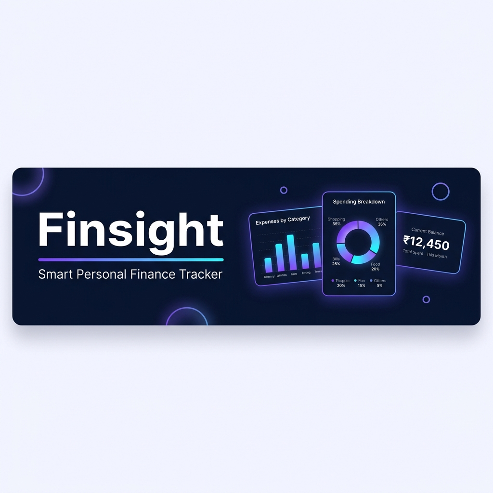
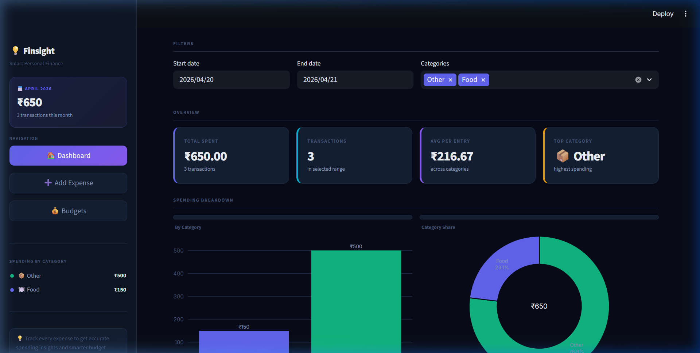
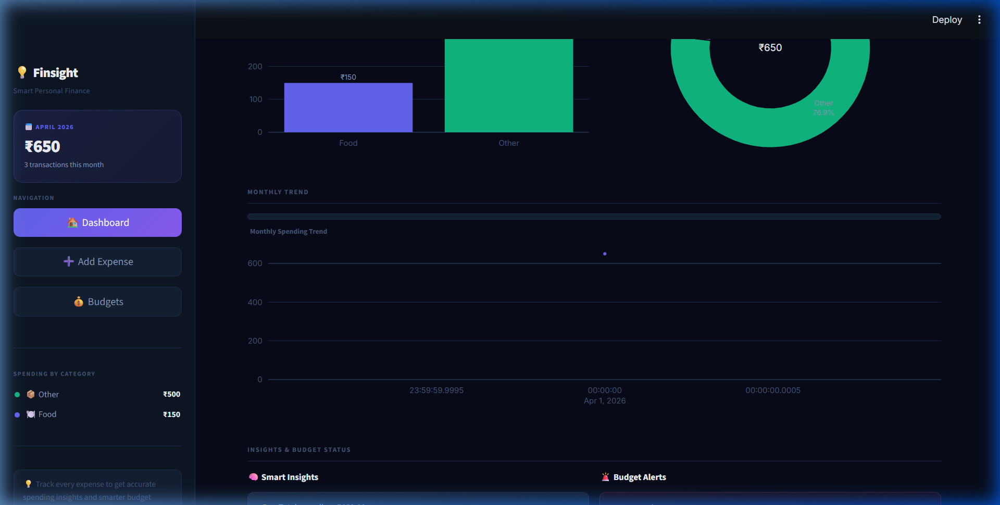
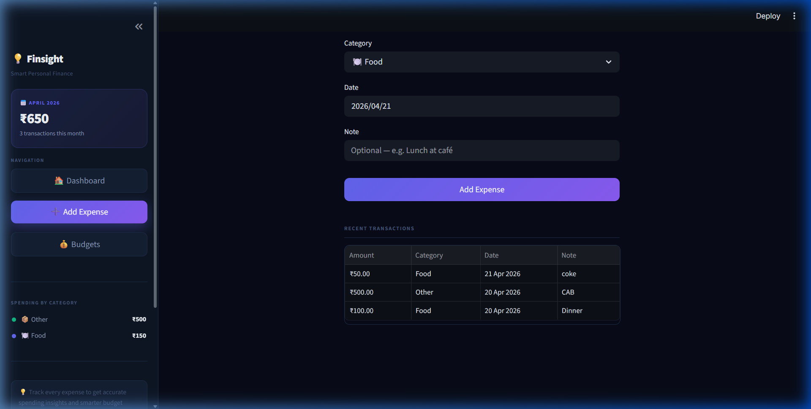
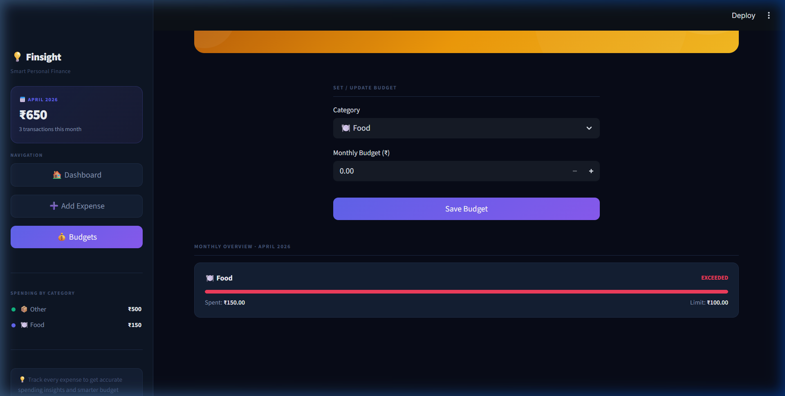
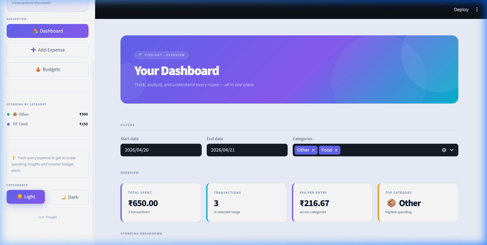

<p align="center">
  
</p>

<h1 align="center">💡 Finsight — Smart Personal Finance Tracker</h1>

<p align="center">
  A polished, professional personal finance dashboard built with Python & Streamlit.<br/>
  Track spending, set budgets, uncover insights — all in one beautifully designed app.
</p>

<p align="center">
  
  
  
  
  
</p>

---

## 📸 Screenshots

### 🌙 Dark Mode — Dashboard


### 🧠 Insights & Monthly Trend


### ➕ Add Expense


### 💰 Budget Manager


### ☀️ Light Mode — Dashboard


---

## ✨ Features

### 📊 Dashboard
- **4 live KPI cards** — Total Spent, Transactions, Average per Entry, Top Category
- **Colorful bar chart** — spending split by category (indigo, cyan, rose, amber, violet, emerald)
- **Interactive donut chart** — category share with center total
- **Monthly trend line chart** — spline line with area fill over time
- **Filterable** — narrow by date range and category using sidebar filters

### 🧠 Smart Insights (Auto-generated)
- Total spending summary
- Top spending category detection
- Week-over-week trend comparison (spending up / down)
- Unusual / high-value transaction detection

### 🚨 Budget Alerts
- Set monthly budget limits per category
- Real-time progress bars showing how much is used
- Color-coded status: **ON TRACK** (green) · **NEAR LIMIT** (amber) · **EXCEEDED** (red)

### ➕ Add Expense
- Log amount, category, date, and note
- Category icons for quick recognition (🍽️ Food · ✈️ Travel · 🛍️ Shopping · 📄 Bills · 🎬 Entertainment · 📦 Other)
- Instant success confirmation with transaction details
- Recent transactions preview below the form

### 💰 Budget Manager
- Set or update monthly budget per category
- Visual progress bars per category (current month data)
- Persistent storage via SQLite

### 🎨 UI/UX
| Feature | Detail |
|---------|--------|
| **Theme** | Light ☀️ / Dark 🌙 toggle in sidebar |
| **Gradient hero banners** | Unique color per page (Indigo→Cyan, Teal→Cyan, Amber→Gold) |
| **Sidebar** | Month stats card, category breakdown, nav buttons, quick tip, theme toggle |
| **Charts** | Fully interactive Plotly charts (hover, zoom) |
| **Typography** | Inter font via Google Fonts |
| **Responsive** | Adapts to all screen sizes via Streamlit's wide layout |

### 📤 Export
- Export filtered data to **CSV** with one click (Download button)

---

## 🏗️ Tech Stack

| Layer | Technology |
|-------|-----------|
| **Frontend** | [Streamlit](https://streamlit.io/) — Python web framework |
| **Charts** | [Plotly](https://plotly.com/python/) — interactive, dark-themed charts |
| **Data** | [Pandas](https://pandas.pydata.org/) — data manipulation |
| **Database** | [SQLite](https://www.sqlite.org/) — lightweight local storage |
| **Styling** | Custom CSS injected via `st.markdown` + Streamlit `config.toml` theming |
| **Language** | Python 3.8+ |

---

## 📁 Project Structure

```
finsight/
│
├── app.py              # Main application — all pages, UI, routing, and CSS
├── database.py         # SQLite CRUD layer (expenses + budgets)
├── insights.py         # Spending insight generation from a filtered DataFrame
├── requirements.txt    # Python dependencies
├── .gitignore          # Excludes the database, exports, and cache from Git
│
├── .streamlit/
│   └── config.toml     # Streamlit theme configuration (dark base + accent colours)
│
├── data/               # Auto-created at runtime; holds the SQLite database
├── exports/            # CSV exports land here when downloaded from the Dashboard
│
└── screenshots/        # App screenshots used in this README
    ├── banner.png
    ├── dashboard_dark.png
    ├── dashboard_insights.png
    ├── add_expense.png
    ├── budgets.png
    └── dashboard_light.png
```

---

## 🚀 Getting Started

### Prerequisites
- Python 3.8 or higher
- pip

### Installation

**1. Clone the repository**
```bash
git clone https://github.com/yourusername/finsight.git
cd finsight
```

**2. Create a virtual environment** *(recommended)*
```bash
python -m venv venv

# Windows
venv\Scripts\activate

# macOS / Linux
source venv/bin/activate
```

**3. Install dependencies**
```bash
pip install -r requirements.txt
```

**4. Run the app**
```bash
streamlit run app.py
```

**5. Open in browser**

The app opens automatically at **http://localhost:8501**

---

## 📦 Dependencies

```txt
streamlit
pandas
plotly
```

> SQLite is part of Python's standard library — no extra installation needed.

---

## 🗃️ Database Schema

### `expenses` table
| Column | Type | Description |
|--------|------|-------------|
| `id` | INTEGER (PK) | Auto-incremented ID |
| `amount` | REAL | Transaction amount in ₹ |
| `category` | TEXT | One of 6 categories |
| `date` | TEXT | Date string (YYYY-MM-DD) |
| `note` | TEXT | Optional description |

### `budgets` table
| Column | Type | Description |
|--------|------|-------------|
| `category` | TEXT (PK) | Category name |
| `limit_amount` | REAL | Monthly budget in ₹ |

---

## 🧩 Module Overview

### `app.py`
The main entry point. Handles:
- Page routing via `st.session_state.page`
- Light / Dark theme switching via `st.session_state.theme`
- All three pages: **Dashboard**, **Add Expense**, **Budgets**
- A CSS design system built up from per-theme colour tokens
- Plotly chart rendering with a shared `plotly_fig()` helper
- Sidebar with live this-month stats and category breakdown

### `database.py`
A thin SQLite CRUD layer — no external ORM needed:
- `create_table()` — creates the expenses table on first run
- `create_budget_table()` — creates the budgets table on first run
- `add_expense(amount, category, date, note)` — inserts a new expense row
- `get_all_expenses()` — returns every expense as a list of tuples
- `set_budget(category, amount)` — inserts or updates a monthly budget limit
- `get_budgets()` — returns all budgets as a `{category: limit_amount}` dict

### `insights.py`
Derives 3–4 plain-English insights from a filtered DataFrame:
- Total spending in the selected period
- Highest-spend category (with amount)
- Week-over-week trend comparison
- Detection of unusually large transactions (> 2× the average)

---

## 💡 Usage Guide

### Step 1 — Add Your Expenses
Navigate to **➕ Add Expense** in the sidebar. Fill in the amount, pick a category, select the date, and optionally add a note. Click **Add Expense**. The entry is saved instantly to the local SQLite database.

### Step 2 — Set Budgets
Go to **💰 Budgets**. Select a category and enter your monthly spending limit. Hit **Save Budget**. The Budget Overview section below shows your current month's usage with a color-coded progress bar.

### Step 3 — Explore the Dashboard
Head to **🏠 Dashboard**. Use the date range and category filters to drill into your data. Explore the:
- **KPI cards** for a quick summary
- **Bar + Donut charts** for category breakdown
- **Trend line** for month-over-month patterns
- **Smart Insights** for auto-generated spending analysis
- **Budget Alerts** to see which categories are over or near limit

### Step 4 — Export
Scroll to the bottom of the Dashboard and click **⬇️ Download CSV** to export your filtered transactions.

---

## 🎨 Theme System

Finsight supports **Dark Mode** (default) and **Light Mode**, togglable from the sidebar.

**Dark Mode palette:**
| Token | Color | Usage |
|-------|-------|-------|
| Background | `#080c18` | App background |
| Surface | `#0e1625` | Sidebar background |
| Card | `#141f33` | Metric cards, chart panels |
| Primary | `#6366f1` | Indigo — buttons, accents |
| Accent 2 | `#8b5cf6` | Violet — gradient end |
| Accent 3 | `#06b6d4` | Cyan — transactions KPI |
| Accent 4 | `#f59e0b` | Amber — top category KPI |

**Light Mode palette:**
| Token | Color | Usage |
|-------|-------|-------|
| Background | `#f0f4ff` | App background |
| Surface | `#ffffff` | Sidebar, cards |
| Border | `#dde5f5` | Dividers, card borders |
| Primary | `#6366f1` | Same indigo across themes |

---

## 🛠️ Customization

### Add a new expense category
In `app.py`, update the `CATEGORIES` list:
```python
CATEGORIES = ["Food", "Travel", "Shopping", "Bills", "Entertainment", "Other", "Health"]
```
And add its icon and color in `CAT_ICON` and `CAT_COLOR` dicts.

### Change the currency symbol
Search for `₹` in `app.py` and replace with your preferred symbol (e.g., `$`, `€`, `£`).

### Change the primary accent color
Update the `P` variable at the top of `app.py`:
```python
P = "#6366f1"   # Change to any hex colour
```

---

## 🙋‍♂️ Author

Built with ❤️ as part of a 6th Semester Python project at **VIPS-TC**.

---

## 📄 License

This project is licensed under the [MIT License](LICENSE).

---

<p align="center">
  <i>Made with Python · Streamlit · Plotly · SQLite</i><br/>
  <b>Finsight — Know where your money goes.</b>
</p>
